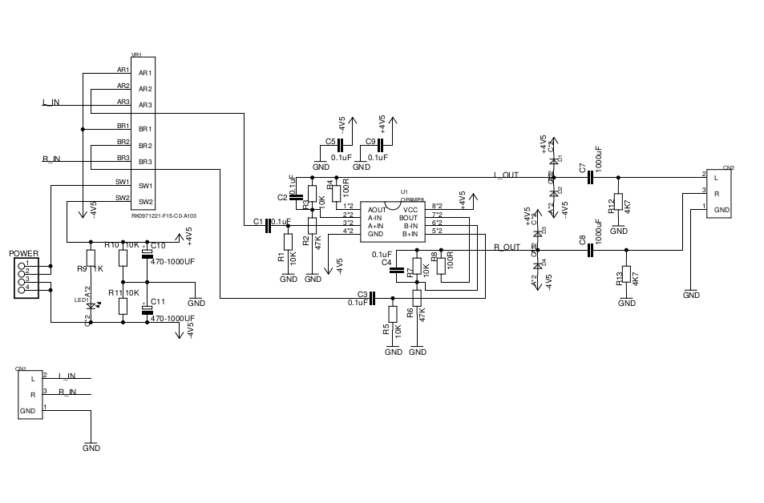
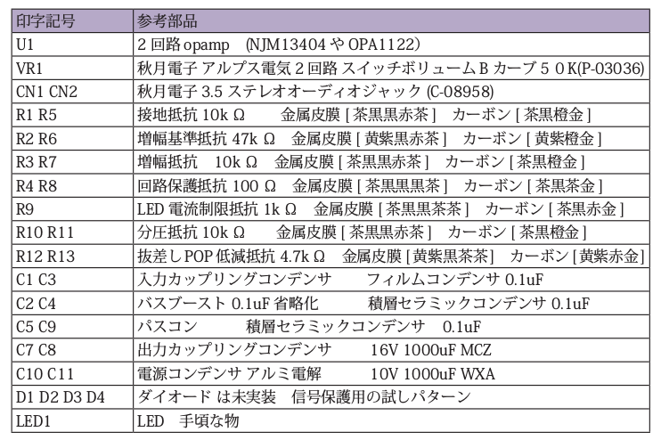

==============================================================
 エナジーアンプ [ENERGY-AMP] サポートページ
==============================================================

☆エナジーアンプ [ENERGY-AMP] について
--------------------------------------------------------------------------------------------------------

C90にて配布を開始したエナジーアンプ（当時B-myi基板)のサポート及び技術解説用のサイトになります。

エナジーアンプの販売は以下のURLにて行っております。

(準備中)

また、エナジーアンプの組み立てキットは以下のURLにて購入することが出来ます。

(準備中)

デスマーチで何時間でも集中したい！音楽聞きながら一気に片付けたい！

単純作業も集中切れずに乗り切りたい！

現代の開発スタイルにうまく合ったヘッドフォンアンプを発明してしまいました。

.. image:: img/DSC_0674.JPG
    :width: 120px

音が良い！という評価では喜びません。

**集中出来た！ 困難を乗り切った！ 一気に片付けられた！**

そんな、エナジードリンクを何本も飲み身体を壊す作業を、音楽の力で健康に楽しく乗りきれればと願い、

今回発明したヘッドフォンアンプを **エナジーアンプ** と名づけました。

皆様の困難な開発、作業、場面にて少しでもお役に立てればと思います。

☆概要解説
--------------------------------------------------------------------------------------------------------

エナジーアンプは、元はB-myiという「Chu-moyヘッドフォンアンプ回路にバスブースト回路を追加した回路」をmyiさんが提案し、
それをNoise博士が基板配線と部品選定、ハンダつけ等を行いました。

Noise博士は丁度、ヘッドフォンアンプを作っている際に運悪く、別件の仕事がデスマーチになりヒーヒー言いながら働き、
深夜自宅で睡眠を削りながらヘッドフォンアンプを面白がって作っては試してを行っていました。

部品選びは調律と同じで、調律者の癖が出てしまいます。
例えば好きな年代があればその音に近づき、好きなジャンルがあればそのジャンルに近づきます。

Noise博士がいい音になった！と思った部品は、どうも「長時間集中して作業出来る音」でした。
きっと、作業していた際のデスマーチが辛く、少しでも長時間の集中が出来ればという願望が強かったのでしょう。

そんなNoise博士と同じ、ここぞと集中したい！そんな時にオススメのヘッドフォンアンプです。

.. image:: img/DSC_0686.JPG
    :width: 120px

☆回路解説
--------------------------------------------------------------------------------------------------------

☆部品解説
--------------------------------------------------------------------------------------------------------

☆組立解説
--------------------------------------------------------------------------------------------------------

.. image:: img/DSC_0513.JPG
    :width: 480px

.. image:: img/DSC_0541.JPG
    :width: 480px

.. image:: img/DSC_0555.JPG
    :width: 480px

☆動作解説
--------------------------------------------------------------------------------------------------------

☆サポート窓口
--------------------------------------------------------------------------------------------------------

 Twitter: @nonNoise

 Mail:kitagami@ArtifactNoise.com
